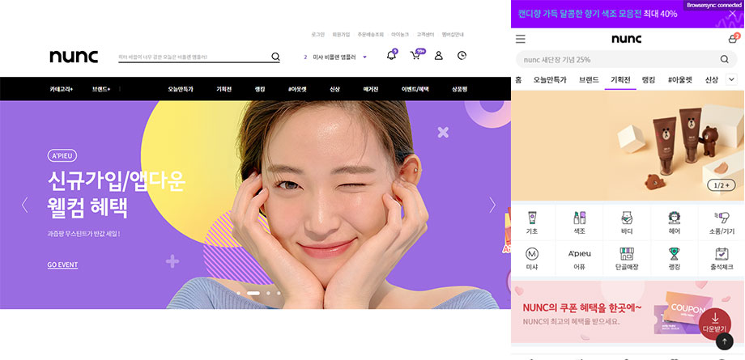
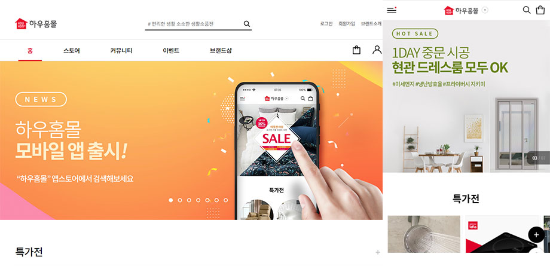
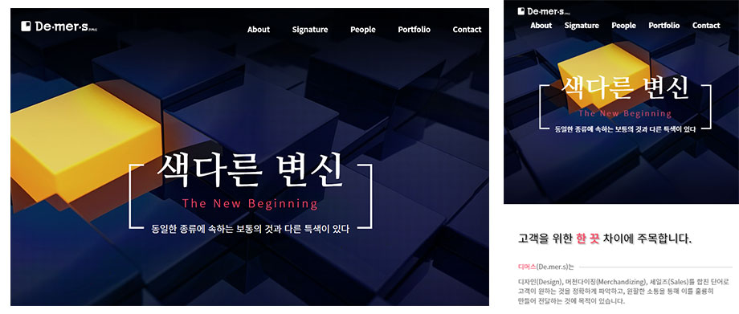

# Portfolio

> 현재까지 작업한 퍼블리싱(마크업) 프로젝트 리스트 입니다.(최신순으로 정렬)

`stack - HTML5 / CSS3 / Sass / jquery / javascript / Gulp `

## 미샤(눙크) - PC/MO

**`[프로젝트 기간]`**

2019년 12월 ~ 2020년 4월

**`[담당]`**

- 마크업 PL역할
- 프로젝트 초기 셋팅 및 공통요소작업/마크업 작업
- 스크립트 개발

## 하우홈몰(노루표페인트) - PC/MO

https://www.howhomemall.com/main

**`[프로젝트 기간]`**

2019년 7월 ~ 2020년 10월

**`[담당]`**

- 프로젝트 초기 셋팅 및 공통요소작업/마크업 작업
- 스크립트 개발

## AK뷰티 - PC/MO

https://www.akbeauty.co.kr/

**`[프로젝트 기간]`**

2019년 4월 ~ 2020년 07월

**`[담당]`**

- PC/MO 공통요소작업/마크업 작업
- 스크립트 개발

## 디머스 - 반응형

http://demers.co.kr/

**`[프로젝트 기간]`**

2019년 2월 ~ 2020년 03월

**`[담당]`**

- 반응형 공통요소 작업 및 페이지 마크업
- 스크립트 개발

## 셀트리온 한스킨 - PC/MO

https://www.hanskin.com/main

**`[프로젝트 기간]`**

2018년 11월 ~ 2019년 02월

**`[담당]`**

- PC/MO 공통요소작업/마크업 작업
- 스크립트 개발

## K CAR(SK엔카) - PC/MO

https://www.kcar.com/index.do(현재 리뉴얼)

**`[프로젝트 기간]`**

2018년 07월 ~ 2018년 10월

**`[담당]`**

- PC/MO 마크업 작업
- 스크립트 개발

## 대한부인비뇨과학회 - PC

**`[프로젝트 기간]`**

2018년 05월 ~ 2018년 06월

**`[담당]`**

- PC/마크업 작업

## GS리테일

**`[프로젝트 기간]`**

2018년 04월 ~ 2018년 05월

**`[담당]`**

- 넥사크로를 이용한 마크업 작업

## 전국 동시 지방선거 - PC/MO

**`[프로젝트 기간]`**

2018년 04월 ~ 2018년 05월

**`[담당]`**

- PC/MO 마크업 작업
- 스크립트 개발

## 듀오이벤트

**`[프로젝트 기간]`**

2018년 04월 ~ 2018년 05월

**`[담당]`**

- 랜딩페이지 마크업개발

### 2018년 이전 프로젝트는 프로젝트명만 기재

- 동원 참치/리챔 이벤트
- 2017 다이아 페스티벌
- 2017 산학협력EXPO
- 김봉곤의 청학동예절학교
- 경원 코퍼레이션
- 더 홀릭스 등등..
