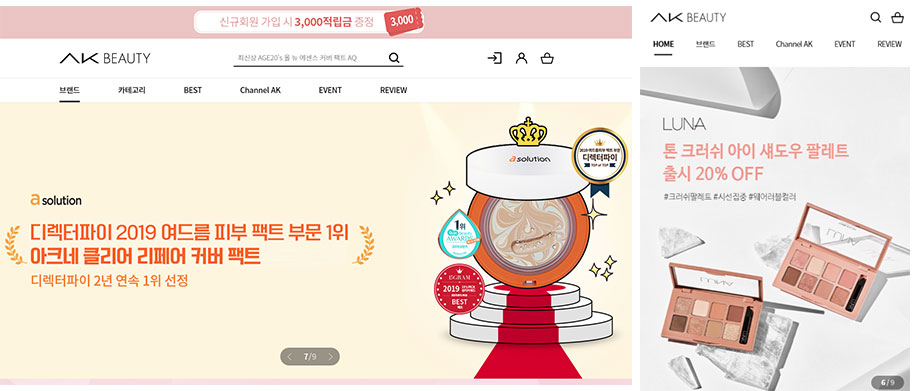

# Portfolio

> 현재까지 작업한 퍼블리싱(마크업) 프로젝트 리스트 입니다.(최신순으로 정렬)

`stack - HTML5 / CSS3 / Sass / jquery / javascript / Gulp `

## 미샤(눙크) - PC/MO

**`[프로젝트 기간]`**

2019년 11월 ~ 2020년 4월

**`[담당]`**

- 퍼블리싱 PL역할
- 프로젝트 초기 셋팅 및 공통요소작업/퍼블리싱 작업
- 스크립트 개발

## 하우홈몰(노루표페인트) - PC/MO

https://www.howhomemall.com/main

**`[프로젝트 기간]`**

2019년 7월 ~ 2019년 10월

**`[담당]`**

- 프로젝트 초기 셋팅 및 공통요소작업/퍼블리싱 작업
- 스크립트 개발

## AK뷰티 - PC/MO

https://www.akbeauty.co.kr/

**`[프로젝트 기간]`**

2019년 4월 ~ 2019년 07월

**`[담당]`**

- PC/MO 공통요소작업/퍼블리싱 작업
- 스크립트 개발

## 디머스 - 반응형

http://demers.co.kr/

**`[프로젝트 기간]`**

2019년 2월 ~ 2019년 03월

**`[담당]`**

- 반응형 공통요소 작업 및 페이지 퍼블리싱
- 스크립트 개발

## 셀트리온 한스킨 - PC/MO

https://www.hanskin.com/main

**`[프로젝트 기간]`**

2018년 11월 ~ 2019년 02월

**`[담당]`**

- PC/MO 공통요소작업/퍼블리싱 작업
- 스크립트 개발

## K CAR(SK엔카) - PC/MO

https://www.kcar.com/index.do(현재 리뉴얼)

**`[프로젝트 기간]`**

2018년 07월 ~ 2018년 10월

**`[담당]`**

- PC/MO 퍼블리싱 작업
- 스크립트 개발

## 대한부인비뇨과학회 - PC

**`[프로젝트 기간]`**

2018년 05월 ~ 2018년 06월

**`[담당]`**

- PC/퍼블리싱 작업

## GS리테일

**`[프로젝트 기간]`**

2018년 04월 ~ 2018년 05월

**`[담당]`**

- 넥사크로를 이용한 퍼블리싱 작업

## 전국 동시 지방선거 - PC/MO

**`[프로젝트 기간]`**

2018년 04월 ~ 2018년 05월

**`[담당]`**

- PC/MO 퍼블리싱 작업
- 스크립트 개발

## 듀오이벤트

**`[프로젝트 기간]`**

2018년 04월 ~ 2018년 05월

**`[담당]`**

- 랜딩페이지 퍼블리싱개발

### 2018년 이전 프로젝트는 프로젝트명만 기재

- 라투인
- 다이아페스티벌
- 산학협력엑스포 2017
- 스카이엔트테인먼트
- 삼다리치킨
- 아시아송페스티벌 2017
- 동원 리챔이벤트
- 수도대기환경청(pc)
- 메이크업유얼하우스(반응형)
- 김봉곤의 청학동예절학교(pc,모바일)
- 모델리아(pc)
- 풍진식품기계(반응형)
- 동원쿡담이벤트(pc)
- 아름드리에스테틱(pc)
- VIP동물의료센터(pc,모바일) 
- 케이앤비 쇼핑몰(반응형)
- 더홀릭스 AMES(pc)
- 더홀릭스 IPDC(pc)
- 동원이벤트(반응형)
- 크리샤츄(pc,모바일)
- 한국식품영양과학회(모바일)
- 선농(반응형)
- 프런티어스쿨(모바일)
- 한국파이프라인(pc)
- 포나인(pc,모바일)
- 영일제약(pc)
- 키맥스(pc)
- 와겐커피(pc)
- 세진이앤이(pc)
- 대왕카스테라(pc)
- 더라인MNC(pc)
- 디딤커뮤니케이션(pc)
- 지아이기계기술(pc)
- 국제저작권기술컨퍼런스(pc)
- MCD(pc)
